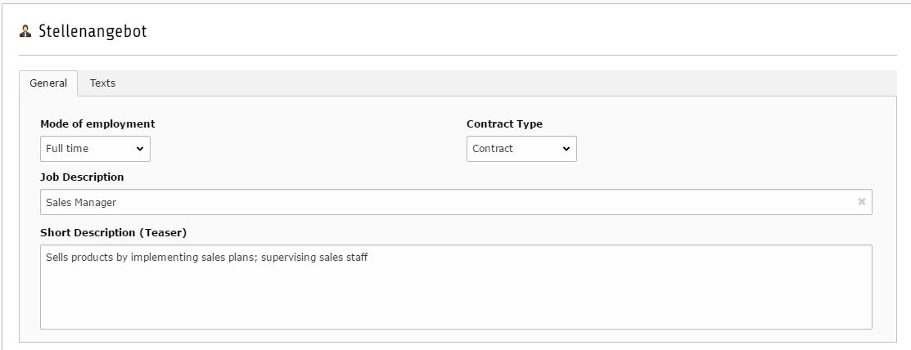
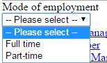

.. include:: ../../Includes.txt

.. _job:

.. image:: ../../Images/logo_dataviewer.png

Jobs
----

In this example, we create a datatype for a job listing with a detail page and search/filtering.

Prerequisites
~~~~~~~~~~~~~

We create a new folder for our fields, datatype and records, so we have a centralized folder, where
the data of the job can be found.

We also need pages for

* Our Job-Listing
* A Job-Detail Page

Fields
######

+----------------+---------------+-----------------------+--------------------+-----------------------------------------------------------------------------+
| Fieldtype      | Tabname       | Label                 | Variable Name      | Explanation                                                                 |
+================+===============+=======================+====================+=============================================================================+
| Select         | 1-General     | Employment Type       | employment         | We need a select field with pre-defined values, so we need to add           |
|                |               |                       |                    | different field-values for all the select options, that we want to offer.   |
|                |               |                       |                    | We also need to refresh the form on change to display different fields      |
|                |               |                       |                    | according to the selection (displayCond), so we enable the Checkbox         |
|                |               |                       |                    | "Request Update (onChange)" in the "Display Conditions"-Tab                 |
+----------------+---------------+-----------------------+--------------------+-----------------------------------------------------------------------------+
| Select         | 1-General     | Contract Type         | contract           | We need a select field with pre-defined values as we made before            |
+----------------+---------------+-----------------------+--------------------+-----------------------------------------------------------------------------+
| Input          | 1-General     | Work hours per day    | workhours          | This is a field, that only shows up, when the employment type "Part-Time"   |
|                |               |                       |                    | was selected. For this, we need to create a Display Condition for this      |
|                |               |                       |                    | field. ``FIELD:50:=:Part-time`` 50 is the id of the Employment-Type Field.  |
|                |               |                       |                    | Another important action is to validate the field for only using numeric    |
|                |               |                       |                    | values, so we enable ``eval = int`` in the Field Configuration.             |
+----------------+---------------+-----------------------+--------------------+-----------------------------------------------------------------------------+
| Input          | 1-General     | Job Description       | jobdescription     | The main name of the job that we also use for our record title, with the    |
|                |               |                       |                    | "Use as record title"-Option that names the record with the value in this   |
|                |               |                       |                    | field.                                                                      |
+----------------+---------------+-----------------------+--------------------+-----------------------------------------------------------------------------+
| Textarea       | 1-General     | Short Description     | teaser             | This is used as a small teaser description                                  |
+----------------+---------------+-----------------------+--------------------+-----------------------------------------------------------------------------+
| RTE            | 2-Texts       | Description           | description        | A html field for entering a detailed job description                        |
+----------------+---------------+-----------------------+--------------------+-----------------------------------------------------------------------------+
| RTE            | 2-Texts       | Requirements          | requirements       | A html field for entering detailed requirements for the job                 |
+----------------+---------------+-----------------------+--------------------+-----------------------------------------------------------------------------+

Template Variables
##################

+---------------------+---------------+----------------------------------------------------------------------------------------------------+
| Type                | Name          | Value                                                                                              |
+=====================+===============+====================================================================================================+
| Fixed Value         | listPageId    | We enter the id of our list page that we will use later for getting back from the detail to the    |
|                     |               | list page.                                                                                         |
+---------------------+---------------+----------------------------------------------------------------------------------------------------+

Datatype
########

We create a datatype called "Job" and assign the fields aswell as a nice Person-Icon to it.

Records
#######

We need some Job-Records of course :)

Plugin for Listing and Details
~~~~~~~~~~~~~~~~~~~~~~~~~~~~~~

*Please refer to the News-Example, to see how to add Listings and a Detail Page.*

Plugin for Searching in the Listing through the Job Title
~~~~~~~~~~~~~~~~~~~~~~~~~~~~~~~~~~~~~~~~~~~~~~~~~~~~~~~~~

The "Target record display plugin, which will follow this plugin" needs to be set to the "Display Records"-Plugin, that already exists
on the page to display the records.

We want to create a searchbox, that searches through the Job Title for the entered searchstring and lists only records that
match the searchstring.

Search type configuration
#########################

Search through record title and fields

Field Search Settings
#####################

+--------------------------+---------------------------------------+
| Filter Combination       | AND                                   |
+--------------------------+---------------------------------------+
| Field                    | Job Description Field                 |
+--------------------------+---------------------------------------+
| Condition                | Like (like)                           |
+--------------------------+---------------------------------------+

Plugin for Filtering in the Listing
~~~~~~~~~~~~~~~~~~~~~~~~~~~~~~~~~~~

The "Target record display plugin, which will follow this plugin" needs to be set to the "Display Records"-Plugin, that already exists
on the page to display the records.

We want to create a filter for selecting the Employment-Type in the frontend, so a visitor can easy select between the employment-types.

Fields for filtering
####################

We select field "Employment Type" and select "Dropdown" for the "Filter Frontend Type".

Options for filters
###################

An empty option as a default option that also can remove the other filters:

+--------------------------+---------------------------------------+
| Filter Combination       | AND                                   |
+--------------------------+---------------------------------------+
| According filter Field   | Employment-Type Field                 |
+--------------------------+---------------------------------------+
| Option Name              | -- Please select --                   |
+--------------------------+---------------------------------------+
| Option Condition         | Not Equal (neq)                       |
+--------------------------+---------------------------------------+
| Option Value             | **Please leave this empty!**          |
+--------------------------+---------------------------------------+

The option for the Full Time Filter:

+--------------------------+---------------------------------------+
| Filter Combination       | AND                                   |
+--------------------------+---------------------------------------+
| According filter Field   | Employment-Type Field                 |
+--------------------------+---------------------------------------+
| Option Name              | Full time                             |
+--------------------------+---------------------------------------+
| Option Condition         | Equal (eq)                            |
+--------------------------+---------------------------------------+
| Option Value             | Full time                             |
+--------------------------+---------------------------------------+

The option for the Part-time Filter:

+--------------------------+---------------------------------------+
| Filter Combination       | AND                                   |
+--------------------------+---------------------------------------+
| According filter Field   | Employment-Type Field                 |
+--------------------------+---------------------------------------+
| Option Name              | Part-time                             |
+--------------------------+---------------------------------------+
| Option Condition         | Equal (eq)                            |
+--------------------------+---------------------------------------+
| Option Value             | Part-time                             |
+--------------------------+---------------------------------------+
