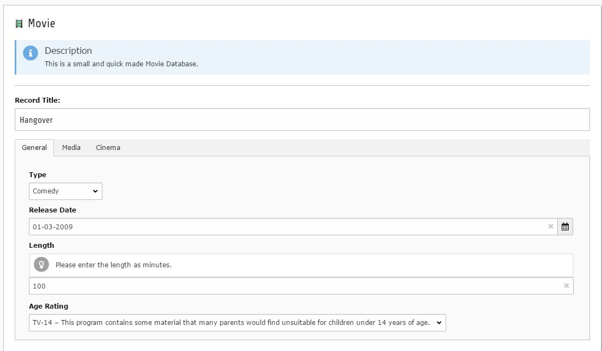
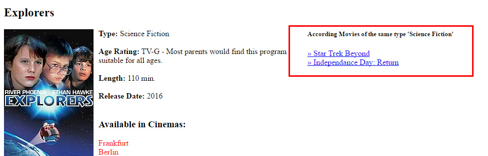
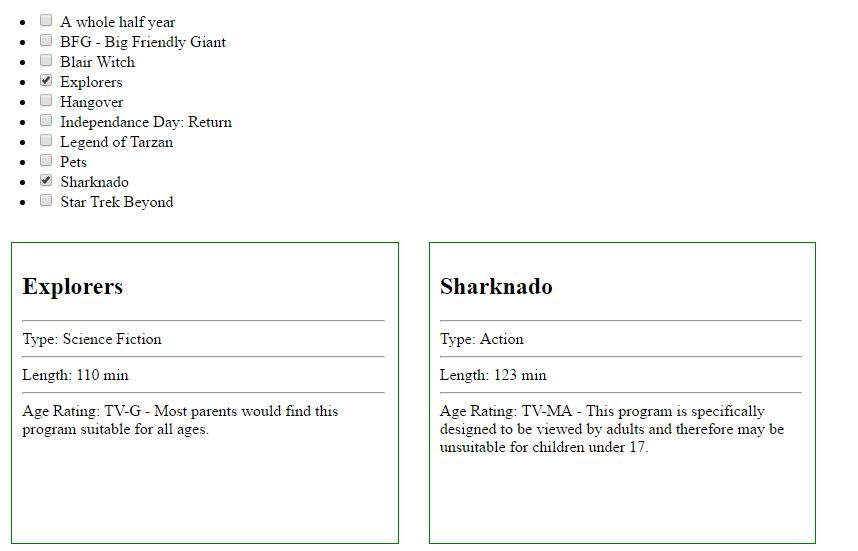

.. include:: ../../Includes.txt

.. _movie:

.. image:: ../../Images/logo_dataviewer.png

Movie
-----

In this example, we create a datatype for a small movie database.
We also create a list for all movies aswell as a list for Sci-Fi Movies.

Our movie-detail page will show equal movies of the same type as a small preview line and links to the according movies.

Prerequisites
~~~~~~~~~~~~~

We create a new folder for our fields, datatype and records, so we have a centralized folder, where
the data of the movies can be found.

We also need pages for

* A complete listing of all movies
* A detail page for a movie
* A page for listing Sci-Fi Movies
* A page for comparing movies

Fields
######

+----------------+---------------+-----------------------+--------------------+---------------------------------------------------------------------------------+
| Fieldtype      | Tabname       | Label                 | Variable Name      | Explanation                                                                     |
+================+===============+=======================+====================+=================================================================================+
| Select         | 1-General     | Type                  | type               | We create this field with all options as fieldvalues for our movie types,       |
|                |               |                       |                    | for example Comedy, Horror, Mystery, Fantasy, Science Fiction                   |
+----------------+---------------+-----------------------+--------------------+---------------------------------------------------------------------------------+
| Date           | 1-General     | Release Date          | releasedate        | We offer a date field for entering the release date of the movie                |
+----------------+---------------+-----------------------+--------------------+---------------------------------------------------------------------------------+
| Input          | 1-General     | Length                | length             | We create a input field for the movie length that is validated as integer       |
|                |               |                       |                    | ``eval = int``. We could also add a Numeric Validator in the Tab "Validation".  |
+----------------+---------------+-----------------------+--------------------+---------------------------------------------------------------------------------+
| Select         | 1-General     | Age Rating            | agerating          | We create all options with adding fieldvalues. For no age rating, we create a   |
|                |               |                       |                    | fieldvalue with "No characterization" and set this as "Is Default", so this     |
|                |               |                       |                    | is a predefined value on every new record                                       |
+----------------+---------------+-----------------------+--------------------+---------------------------------------------------------------------------------+
| Image          | 2-Media       | Cover                 | cover              | This shows an image selection field for the Movie Cover.                        |
+----------------+---------------+-----------------------+--------------------+---------------------------------------------------------------------------------+
| Checkbox       | 3-Cinema      | Cinema                | cinema             | We create a checkbox field for selecting Cinema's, where the movie will be      |
|                |               |                       |                    | shown.                                                                          |
+----------------+---------------+-----------------------+--------------------+---------------------------------------------------------------------------------+

Template Variables
##################

+------------------------+---------------+----------------------------------------------------------------------------------------------------+
| Type                   | Name          | Value                                                                                              |
+========================+===============+====================================================================================================+
| Fixed Value            | listPageId    | We enter the id of our list page that we will use later for getting back from the detail to the    |
|                        |               | list page.                                                                                         |
+------------------------+---------------+----------------------------------------------------------------------------------------------------+
| GET Variable           | id            | We retrieve the current page id from the url.                                                      |
|                        |               | This id can also be extracted from the cObj with ``{cObj.pid}``                                    |
+------------------------+---------------+----------------------------------------------------------------------------------------------------+
| Dynamic Record         | baseRecord    | This injects the same record, that is used in the "Dynamic Detail"-View of the "Display Records"-  |
| (from LinkViewHelper)  |               | Plugin                                                                                             |
+------------------------+---------------+----------------------------------------------------------------------------------------------------+

Datatype
########

We create a datatype called "Movie" and assign the fields aswell as a nice Movie-Icon to it.

Records
#######

We need some Movie-Records of course :)

Plugin for Listing and Details
~~~~~~~~~~~~~~~~~~~~~~~~~~~~~~

*Please refer to the News-Example, to see how to add Listings and a Detail Page.*

Additional Records of Type "Science Fiction" on the Movie-Detail page
#####################################################################

We add another "Display Records"-Plugin to our Movie-Detail Page, which we will use to display
according movies of the same type. The additional plugin only displays the according records
in a simple list. Each record is linked to the detail page. We also have to include the Template
Variables "baseRecord" and "id".

*Template Example*

.. code-block:: html

	{namespace dv=MageDeveloper\Dataviewer\ViewHelpers}

	<h5>According Movies of the same type '{baseRecord.type.value}'</h5>
	<f:if condition="{records -> f:count()} <= 0">
		<f:then>No according records found</f:then>
		<f:else>
			<f:for each="{records}" as="record" iteration="i">
				<dv:record.link record="{record}" pid="{id}">&raquo;&nbsp;{record.title}</dv:record.link>
				<f:if condition="{i.isLast} == 0"> </f:if>
			</f:for>
		</f:else>	
	</f:if>
	

Listing only Science Fiction Movies
###################################

We do the same as in the Listing but we add a filter in the Tab "Field/Value Filter Settings"
Example Filter Configuration:

+--------------------------+---------------------------------------+
| Filter Combination       | AND                                   |
+--------------------------+---------------------------------------+
| Field                    | Movie Type                            |
+--------------------------+---------------------------------------+
| Condition                | Equal (eq)                            |
+--------------------------+---------------------------------------+
| Option Value             | Science Fiction                       |
+--------------------------+---------------------------------------+

.. note::

   If you are not sure, what you are doing, if is helpful to enable the "Debug"-Mode in the Tab "Developer Settings".
   The frontend-output will give you additional information about the Database-Query that is made as well as some 
   additional information, how the data is obtained.

Plugin for Selecting / Comparing Movies
~~~~~~~~~~~~~~~~~~~~~~~~~~~~~~~~~~~~~~~

We create a fluid template for comparing two selected movies and showing same details in a twin-view.
So we need a template that gets two records and displays them side by side.

Select-Plugin Configuration
###########################

The "Target record display plugin, which will follow this plugin" needs to be set to the "Display Records"-Plugin, that already exists
on the page to display the records.

The ``Selection Limit`` is configured with ``2``

*Example Template*

The following template observes the number of the records and displays all possible actions when no record is selected, one record is selected 
or two records are selected.

.. code-block:: html

	{namespace dv=MageDeveloper\Dataviewer\ViewHelpers}
	
	<f:if condition="{records -> f:count()} == 0">
		
No selection

		
No selection

	</f:if>
	<f:if condition="{records -> f:count()} == 1">
		

			<dv:render.template template="fileadmin/templates/dataviewer/movies/Partials/MovieCompare.html" arguments="{record:records.0}" />
		

		

			Please select a second record
		

	</f:if>
	<f:if condition="{records -> f:count()} == 2">
		

			<dv:render.template template="fileadmin/templates/dataviewer/movies/Partials/MovieCompare.html" arguments="{record:records.0}" />
		

		

			<dv:render.template template="fileadmin/templates/dataviewer/movies/Partials/MovieCompare.html" arguments="{record:records.1}" />
		

	</f:if>

*Example Template 'MovieCompare.html'*

DataViewer can render templates with a ViewHelper so you can use this to render things like partials.

.. code-block:: html

	

		<h2>{record.title}</h2>
		

		Type: {record.type.value}
		

		Length: {record.length.value} min
		

		Age Rating: {record.agerating.value}
	

