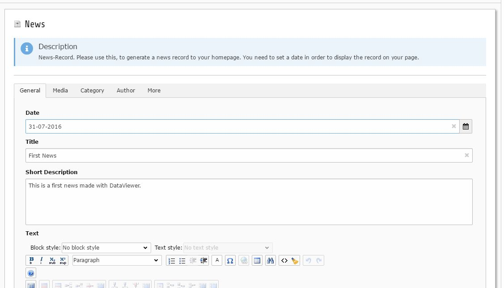

.. include:: ../../Includes.txt

.. _news:

.. image:: ../../Images/logo_dataviewer.png

News
----

In this example, we will create a news datatype with a frontend plugin for listing the newest records (last week) as
a teaser on our homepage that leads to a detail page for a News-Entry.

Prerequisites
~~~~~~~~~~~~~

We create a new folder for our fields, datatype and records, so we have a centralized folder, where
the data of the news can be found.

We also need pages for

* Our News-Listing
* A News-Detail Page

Fields
######

+----------------+---------------+-----------------------+--------------------+-----------------------------------------------------------------------------+
| Fieldtype      | Tabname       | Label                 | Variable Name      | Explanation                                                                 |
+================+===============+=======================+====================+=============================================================================+
| Date           | 1-General     | Date                  | date               | Our news has a date field that we also will use for sorting                 |
+----------------+---------------+-----------------------+--------------------+-----------------------------------------------------------------------------+
| Input          | 1-General     | News Title            | newstitle          | The title of the news, we also set "Use as record title", so the backend    |
|                |               |                       |                    | shows the content of this field as the record title.                        |
|                |               |                       |                    | We add a "Not Empty Value"-Validator and a "String Length"-Validator        |
|                |               |                       |                    | with options ``minimum=0;maximum=255`` to be sure it's not too long.        |
+----------------+---------------+-----------------------+--------------------+-----------------------------------------------------------------------------+
| Textarea       | 1-General     | Short Description     | description        | A teaser description for our news, that will be used in small lists         |
+----------------+---------------+-----------------------+--------------------+-----------------------------------------------------------------------------+
| RTE            | 1-General     | Text                  | text               | The news contents as html text                                              |
+----------------+---------------+-----------------------+--------------------+-----------------------------------------------------------------------------+
| Image          | 2-Media       | Main Image            | image              | The main image, that every news must have.                                  |
|                |               |                       |                    | We add a "Not Empty Value"-Validator so we can be sure this field is        |
|                |               |                       |                    | filled with a value                                                         |
+----------------+---------------+-----------------------+--------------------+-----------------------------------------------------------------------------+
| Relation       | 2-Media       | Additional Images     | additionalimages   | We set "allowed" to ``jpg,jpeg,gif,png``, so only images are allowed.       |
+----------------+---------------+-----------------------+--------------------+-----------------------------------------------------------------------------+
| Category       | 3-Category    | Category              | category           | We create some Categories in our folder that we assign in                   |
|                |               |                       |                    | "Category Sources" in our field configuration and we add a                  |
|                |               |                       |                    | "Not Empty Value"-Validator, to be sure at least one category is selected   |
+----------------+---------------+-----------------------+--------------------+-----------------------------------------------------------------------------+
| Select         | 4-Author      | Author                | author             | We use frontend users that can be assigned to a news.                       |
|                |               |                       |                    | For this, we need to select ``foreign`` in the field configuration and      |
|                |               |                       |                    | select foreign_table ``fe_users`` with the Class Name of the according      |
|                |               |                       |                    | model to ``TYPO3\CMS\Extbase\Domain\Model\FrontendUser``, to receive the    |
|                |               |                       |                    | complete FrontendUser-Model in the frontend, when we use                    |
|                |               |                       |                    | ``{record.author.value}``                                                   | 
+----------------+---------------+-----------------------+--------------------+-----------------------------------------------------------------------------+
| Dynamic Input  | 5-More        | Tags                  | tags               | This field is used for dynamically creating tags                            |
+----------------+---------------+-----------------------+--------------------+-----------------------------------------------------------------------------+

Template Variables
##################

+---------------------+---------------+----------------------------------------------------------------------------------------------------+
| Type                | Name          | Value                                                                                              |
+=====================+===============+====================================================================================================+
| TypoScript Value    | lastWeek      | The following TypoScript gives us a timestamp of the current time -7 days                          |
|                     |               |                                                                                                    |
|                     |               | .. code-block:: typoscript                                                                         |
|                     |               |                                                                                                    |
|                     |               |    10 = TEXT                                                                                       |
|                     |               |    10 {                                                                                            |
|                     |               |      current = 1                                                                                   |
|                     |               |      setCurrent.data = date:U                                                                      |
|                     |               |      setCurrent.wrap = | - 604800                                                                  |
|                     |               |      prioriCalc = 1                                                                                |
|                     |               |    }                                                                                               |
|                     |               |                                                                                                    |
|                     |               |                                                                                                    |
+---------------------+---------------+----------------------------------------------------------------------------------------------------+
| Fixed Value         | listPageId    | We enter the id of our list page that we will use later for getting back from the detail to the    |
|                     |               | list page.                                                                                         |
+---------------------+---------------+----------------------------------------------------------------------------------------------------+

Datatype
########

We create a datatype called "News" and assign the fields aswell as a nice Newspage-Icon to it.

Records
#######

We need some News-Records of course :)

Plugin for News Listing
~~~~~~~~~~~~~~~~~~~~~~~

First of all, we need to select our News-Folder in "Record Storage Page" and press "Save"

We insert the plugin "Display Records" on the page, where we want to display our latest news records and select "List" on the "Plugin Type"

Filtering for newest (-7 days) records
######################################

Our TypoScript-Template Variable "{lastWeek}" helps us to get newer records. We just add a new filter in the
"Field/Value Filter Settings"-Tab with the following settings:

+----------------------+---------------------------------------+
| Filter Combination   | AND                                   |
+----------------------+---------------------------------------+
| Field                | News-Date Field                       |
+----------------------+---------------------------------------+
| Condition            | Greater Than or Equal (gteq)          |
+----------------------+---------------------------------------+
| Field Value          | {lastWeek}                            |
+----------------------+---------------------------------------+

Sorting
#######

We set the "Default sort field" to our News-Date Field

Template
########

We create a new fluid template somewhere in our fileadmin-Folder and select it in "Fluid Template".
The contents of the template is the code, that is rendered in the frontend to display our latest news.
Here is an example for displaying the latest news:

.. code-block:: html

	{namespace dv=MageDeveloper\Dataviewer\ViewHelpers}

	<f:if condition="{records}">
		<f:for each="{records}" as="record" iteration="i">
			<h3>{record.newstitle.value}</h3>
			<f:format.date format="Y-m-d">{record.date.value}</f:format.date>
			

				<f:image src="fileadmin/{record.image.value.0.identifier}" height="30" />
			

			<f:if condition="{i.isLast} == 0">
</f:if>
			<f:format.crop maxCharacters="135" append="&nbsp;[...]">{record.description.value}</f:format.crop>
			<dv:record.link record="{record}" pid="{settings.detail_page_id}">show</dv:record.link>
		</f:for>
	</f:if>

Plugin for News Details
~~~~~~~~~~~~~~~~~~~~~~~

First of all, we need to select our News-Folder in "Record Storage Page" and press "Save"

We insert the plugin "Display Records" on the page with the "Plugin Type" "Dynamic Detail", where we want to display our detailed information on a selected news in our News-Listing.
For "Allow or Show records by selection type", we can select "All Records on selected Storage Page(s)", so all News-Records are allowed to be used with this plugin.

Template
########

We create a new fluid template somewhere in our fileadmin-Folder and select it in "Fluid Template".
The contents of the template is the code, that is rendered in the frontend to display the news details.
Here is an example for displaying news details:

.. code-block:: html

	<f:link.page pageUid="{listPageId}">&laquo;&nbsp;Go Back</f:link.page>
	

	<f:if condition="{record}">
		<f:then>
			<f:format.date format="Y-m-d">{record.date.value}</f:format.date>
			<h1>{record.newstitle.value}</h1>
			

				<f:image src="fileadmin/{record.image.value.0.identifier}" height="60" />
			

			

				<f:format.html parseFuncTSPath="">{record.text.value}</f:format.html>
				<em>written by {record.author.value.name}</em>
				 
				<em>Categories: <f:for each="{record.category.value}" as="category">{category.title}&nbsp;&nbsp;&nbsp;</f:for></em>
				
				 
				<h4>Tags:</h4>
				<f:for each="{record.tags.value}" as="tag">
					#{tag} 
				</f:for>
	
				<f:if condition="{record.additionalimages.value}">
					<h5>Additional Images:</h5>
					<f:for each="{record.additionalimages.value}" as="additionalimage">
						<f:image src="{additionalimage.publicUrl}" height="30" />
					</f:for>
				</f:if>
			

		</f:then>
		<f:else>
			NO NEWS ID GIVEN
		</f:else>
	</f:if>

Variable Injection
##################

We need to inject "Fixed Value 'listPageId'" to the template, so we have a dynamic value that leads to the News-Listing Page.
