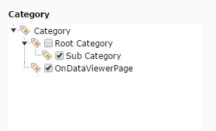

.. ==================================================
.. FOR YOUR INFORMATION
.. --------------------------------------------------
.. -*- coding: utf-8 -*- with BOM.

.. include:: ../../Includes.txt

.. _category:

.. image:: ../../Images/Fieldtype/category.gif
   :align: left

Category
--------

This field displays a category tree in the backend form with the categories, that are selected
in the Category Sources Configuration.

Screenshot
~~~~~~~~~~

Additional Configuration Options
~~~~~~~~~~~~~~~~~~~~~~~~~~~~~~~~

* **Category Sources**
Please select the sites, where the Category-Records are stored. All Categories from the selected pages
will appear in the Category-Field

* **showHeader**
Shows the header of the tree element

* **expandAll**
Expands the tree when the form is loaded

* **minitems**
Minimum of items that can be selected

* **maxitems**
Maximum number of items that can be selected

* **multiple**
Same item more than once can be selected

 
