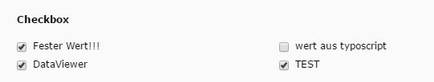

.. include:: ../../Includes.txt

.. _checkbox:

.. image:: ../../Images/Fieldtype/checkbox.gif
   :align: left

Checkbox
--------

This field can create checkboxes for selecting entries.
Items for the selection are added through the FieldValues that you can add in the Field Configuration.

Screenshot
~~~~~~~~~~

Additional Configuration Options
~~~~~~~~~~~~~~~~~~~~~~~~~~~~~~~~

cols
   Amount of columns in which the checkboxes shall be displayed

