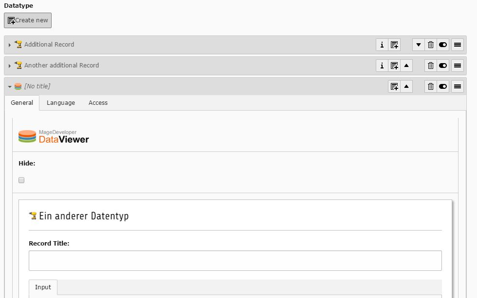

.. include:: ../../Includes.txt

.. _datatype:

.. image:: ../../Images/Fieldtype/datatype.gif
   :align: left

Datatype
--------

This field can contain inline elements by the selected datatype.

Screenshot
~~~~~~~~~~

Additional Configuration Options
~~~~~~~~~~~~~~~~~~~~~~~~~~~~~~~~

Datatype
   The selected Datatype will be used when creating new inline elements

size
   Height of the selector box

minitems
   Minimum of items that can be selected

maxitems
   Maximum number of items that can be selected

