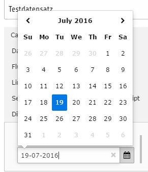

.. include:: ../../Includes.txt

.. _date:

Date
----

This field is for entering a date with a date-wizard for easy selecting a value.

Screenshot
~~~~~~~~~~

Additional Configuration Options
~~~~~~~~~~~~~~~~~~~~~~~~~~~~~~~~

eval
   Adds evaluation conditions to the field

placeholder
   The placeholder value for the field

range (lower)
   The lower range of the value for the field

range (upper)
   The upper range of the value for the field

 
