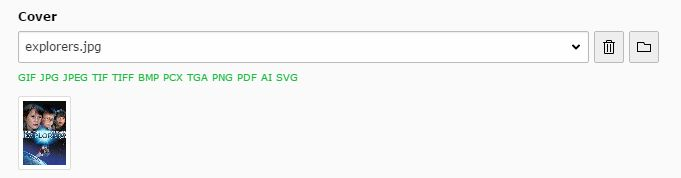

.. include:: ../../Includes.txt

.. _file:

File
----

This field adds an file selection field to the form which opens the file-browser popup

Screenshot
~~~~~~~~~~

Additional Configuration Options
~~~~~~~~~~~~~~~~~~~~~~~~~~~~~~~~

size
   Height of the selector box

allowed
   Comma-separated list of allowed file types

* **disallowed**
Comma-separated list of disallowed file types

* **max_size**
Maximum file size allowed in KB

* **show_thumbs**
Show Thumbnails of the files

* **selectedListStyle**
Overrides the style of the element

* **multiple**
Same item more than once can be selected

* **hideMoveIcons**
Removes the move icons near the selector box

* **minitems**
Minimum of items that can be selected

* **maxitems**
Maximum number of items that can be selected

* **disable_controls**
Disables selected controls

 
