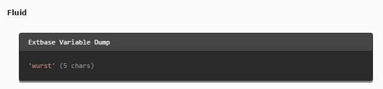

.. include:: ../../Includes.txt

.. _fluid:

Fluid
--------

This field can contain fluid and/or html code that will be displayed in the backend and is also rendered in the frontend.

Screenshot
~~~~~~~~~~

Additional Configuration Options
~~~~~~~~~~~~~~~~~~~~~~~~~~~~~~~~

Show in Backend
   Shows the rendered output in the backend

 
