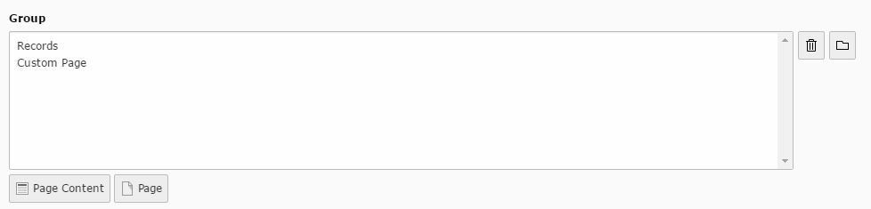

.. ==================================================
.. FOR YOUR INFORMATION
.. --------------------------------------------------
.. -*- coding: utf-8 -*- with BOM.

.. include:: ../../Includes.txt

.. _group:

.. image:: ../../Images/Fieldtype/group.gif
   :align: left

Group
-----

Creates a group field for record selection.

Screenshot
~~~~~~~~~~

Additional Configuration Options
~~~~~~~~~~~~~~~~~~~~~~~~~~~~~~~~

* **internal_type**
Configures the internal type of the group element

* **allowed**
Comma-separated list of allowed types (e.g. tt_content,pages)

* **minitems**
Minimum of items that can be selected

* **maxitems**
Maximum number of items that can be selected

* **size**
Height of the selector box

* **hideMoveIcons**
Hides the move icons

* **disable_controls**
Disables selected controls

 
