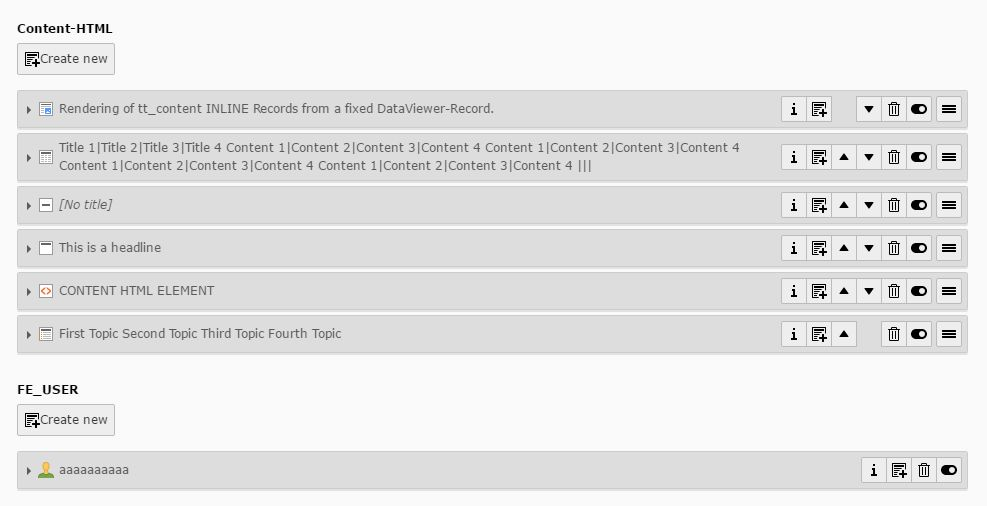

.. include:: ../../Includes.txt

.. _inline:

Inline
------

This field can contain inline elements of different types. The frontend value can differ from
the model or an returned array with the value.

Screenshot
~~~~~~~~~~

Additional Configuration Options
~~~~~~~~~~~~~~~~~~~~~~~~~~~~~~~~

foreign_table
   The foreign table for the records

Class Name of the according model
   The class name of the according model that will be delivered in the frontend value

foreign_record_defaults
   Defaults, when a new record is added

minitems
   Minimum of items that can be selected

maxitems
   Maximum number of items that can be selected

