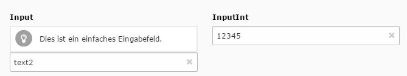

.. ==================================================
.. FOR YOUR INFORMATION
.. --------------------------------------------------
.. -*- coding: utf-8 -*- with BOM.

.. include:: ../../Includes.txt

.. _input:

.. image:: ../../Images/Fieldtype/input.gif
   :align: left

Input
------

Creates an input element to the form

Screenshot
~~~~~~~~~~

Additional Configuration Options
~~~~~~~~~~~~~~~~~~~~~~~~~~~~~~~~

* **eval**
Adds evaluation conditions to the field

* **placeholder**
The placeholder value for the field

* **max**
Minimum amount of chars for this field

 
