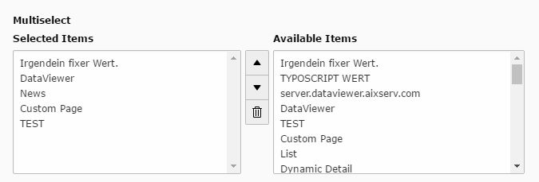

.. include:: ../../Includes.txt

.. _multiselect:

.. image:: ../../Images/Fieldtype/multiselect.gif
   :align: left

MultiSelect
-----------

Adds an multiselect box to the form for selecting entries.
Items for the selection are added through the FieldValues that you can add in the Field Configuration.

Screenshot
~~~~~~~~~~

Additional Configuration Options
~~~~~~~~~~~~~~~~~~~~~~~~~~~~~~~~

minitems
   Minimum of items that can be selected

maxitems
   Maximum number of items that can be selected

foreign
   Opens the foreign_table Settings

Class Name of the according model
   The class name of the according model that will be delivered in the frontend value

foreign_table_where
   The WHERE Clause for the foreign table

 
