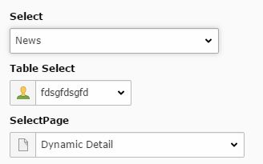

.. include:: ../../Includes.txt

.. _select:

Select
------

Adds an select box to the form for selecting an entry.
Items for the selection are added through the FieldValues that you can add in the Field Configuration.

Screenshot
~~~~~~~~~~

Additional Configuration Options
~~~~~~~~~~~~~~~~~~~~~~~~~~~~~~~~

foreign
   Opens the foreign_table Settings

Class Name of the according model
   The class name of the according model that will be delivered in the frontend value

foreign_table_where
   The WHERE Clause for the foreign table

 
