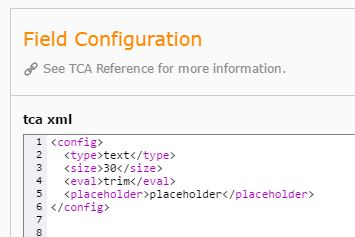

.. include:: ../../Includes.txt

.. _select:

.. image:: ../../Images/Fieldtype/tca.gif
   :align: left

TCA
----

Creates an field by TCA Configuration. The TCA Configuration is made by XML Nodes.

Screenshot
~~~~~~~~~~

Additional Configuration Options
~~~~~~~~~~~~~~~~~~~~~~~~~~~~~~~~

tca xml
   The XML TCA Configuration for the field

 
