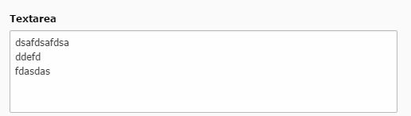

.. include:: ../../Includes.txt

.. _select:

.. image:: ../../Images/Fieldtype/textarea.gif
   :align: left

Textarea
--------

Creates an textarea for longer texts.

Screenshot
~~~~~~~~~~

Additional Configuration Options
~~~~~~~~~~~~~~~~~~~~~~~~~~~~~~~~

eval
   Adds evaluation conditions to the field

renderType
   The render type for the text area

cols
   The amount of columns for the textfield

rows
   The amount of rows for the textfield

placeholder
   The placeholder value for the field

max
   Minimum amount of chars for this field

wrap
   Determines the wrapping of the textarea field

 
