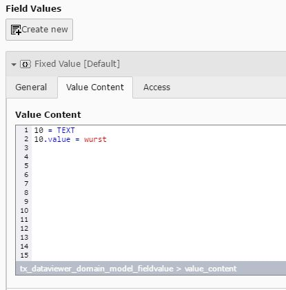

.. include:: ../../Includes.txt

.. _select:

.. image:: ../../Images/Fieldtype/typoscript.gif
   :align: left

TypoScript
----------

Creates an TypoScript that can be displayed in the backend and is also rendered in the frontend.
The TypoScript is rendered from the Field Values.

Screenshot
~~~~~~~~~~

Additional Configuration Options
~~~~~~~~~~~~~~~~~~~~~~~~~~~~~~~~

Show in Backend
   Shows the rendered output in the backend

 
