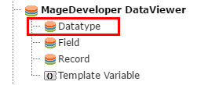
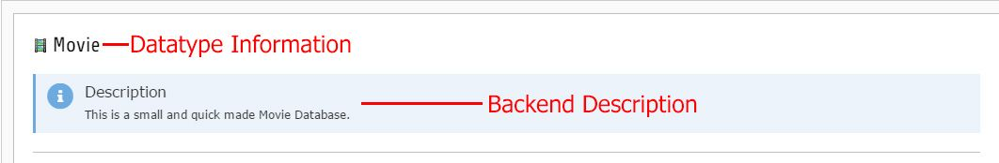

.. include:: ../../Includes.txt

.. _datatype_gs:

.. image:: ../../Images/logo_dataviewer.png

Creating a new Datatype
-----------------------

Please go to the list module or the DataViewer Backend Module, click on "Create a new record" and select "Datatype".
You need to have fields for assigning them to the Datatype. If you did not create fields, you can assign them later.

Configuration
~~~~~~~~~~~~~   

Tab "General"
#############

-------------------------------

Name
   A name for your Datatype (e.g. Movie, News, Job, Address or any other you want!)

Description
   A description text, that will be showed in the backend when creating/editing records.

Template File for Rendering (PartViewHelper)
   This Datatype can have a separate rendering template. When used the PartViewHelper,
   it can render the whole Datatype as a finalized html result.

Fields
   The fields, that the Datatype contains. The ordering of the fields is used in displaying the record.

Tab "Appearance"
################

-------------------------------

Icon
   The icon of the Datatype that will be displayed in the backend.

Color
   Lets you change the background color, when you are creating/editing a record.

Hide Records of this type in list
   If this checkbox is enabled, all records of this type will be hidden in the backend lists.
   This option can be used, when a Datatype can have other Datatypes as Inline-Elements.
   These elements are not needed to be displayed in the backend.
