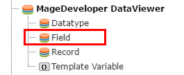
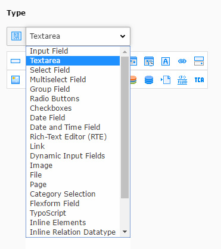
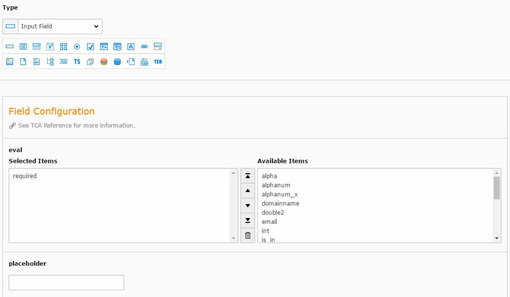
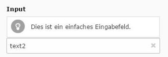
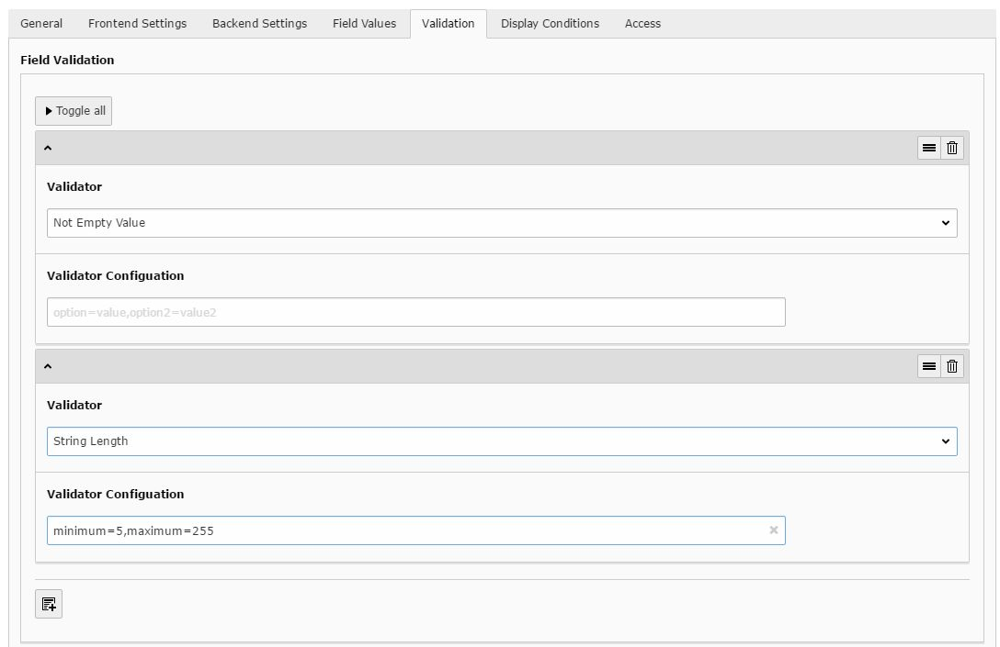

.. include:: ../../Includes.txt

.. _field_gs:

.. image:: ../../Images/logo_dataviewer.png

Creating a new Field
--------------------

Please go to the list module, click on "Create a new record" and select "Field".

Configuration
~~~~~~~~~~~~~

Tab "General"
#############

Type
   This selection determines the type of the field.

Field Configuration
   The field configuration depends on the type, that is selected above.
   Please refer to the Fieldtypes-Section, to learn about each configuration.

Use as record title
   If checked, the value of the field will be used in the backend as the title of the record.

Tab "Frontend Settings"
#######################

Frontend Label
   The Label of the field. This will also be converted to the variable name.
   You can see the accessible variable name below.

Custom Variable Name
   Unique custom variable name to override the automatically generated variable name.

Template File for Part-Rendering (PartViewHelper)
   This Field can have a separate rendering template. When used the PartViewHelper,
   it can render the whole Field as a finalized html result.

Tab "Backend Settings"
######################

Name of the Tab to add to
   Each field can be assigned to a tab. If you leave this setting empty, the field will be assigned to "General".

.. note:: *Sorting:* It is possible to sort tabs if you enter a name like 1-General, 2-Media. The sorting will then made by the number that is prefixed.

Show Title
   Disabling this will hide the title in the backend so that only the field is displayed.

Backend Description
   If this is filled with text, the text is displayed in the record form next to the field.

Backend Column Width
   You can change the column width with this setting.

Backend Css Class
   You can add a custom css class to the field with this setting.

Tab "Field Values"
##################

This is the place where you can create the values of a field.
Values can be of different types:

+----------------------------+-------------------------------------------------------------------------------------------------+
| Field Value Type           | Description                                                                                     |
+============================+=================================================================================================+
| **Fixed Value**            | This creates a fixed value where the content is just a text value                               |
+----------------------------+-------------------------------------------------------------------------------------------------+
| **Database Value**         | This can create a value that comes from the database with the given query                       |
+----------------------------+-------------------------------------------------------------------------------------------------+
| **TypoScript**             | This creates a TypoScript Value with the TypoScript Code being executed in the Value Content    |
+----------------------------+-------------------------------------------------------------------------------------------------+
| **All values of a field**  | This gets all values of a field that exist and will return them                                 |
+----------------------------+-------------------------------------------------------------------------------------------------+

.. This is comment. Just to help you.
.. You can write "simple tables" like this easier in this way.
.. see: http://docutils.sourceforge.net/docs/user/rst/quickref.html#tables
..
.. ==========================  ===========================
..  Field Value Type            Description
.. --------------------------  ---------------------------
.. **Fixed Value**             This creates a fixed value where the content is just a text value
.. **Database Value**          This can create a value that comes from the database with the given query
.. **TypoScript**              This creates a TypoScript Value with the TypoScript Code being executed in the Value Content
.. **All values of a field**   This gets all values of a field that exist and will return them
.. ==========================  ============================

A value can be set as ``Is Default`` when a select box needs a default value or a input field has to be prefilled.
If you set ``Pretends to be an empty value``, the value that is returned is empty. This can create a select box option
with no value.

Tab "Validation"
################

Fields can be validated during the save procedure. All available validators can be selected in
the field tab ``Validation`` as showed in the screenshot.

.. note:: *Add custom validator*:
          Adding a custom validator is made within the Plugin TypoScript.
          The following lines show you how to add a new custom validator.

          The validator itself has to implement :php:`\TYPO3\CMS\Extbase\Validation\Validator\ValidatorInterface`

          .. code-block:: typoscript

             plugin.tx_dataviewer.validators {
                custom {
                   validatorClass = Vendor\Extension\Validation\Validator\CustomValidator
                   label = LLL:EXT:extension/Resources/Private/Language/locallang.xlf:validator.custom
                }
             }

Tab "Display Conditions"
########################

The field can be showed or hidden matching Display Conditions.
Available field ids will be displayed above.

The syntax is :php:`FIELD:2:IN:Selection 1,Selection2`
