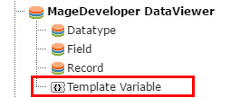

.. include:: ../../Includes.txt

.. _variable_gs:

.. image:: ../../Images/logo_dataviewer.png

Creating a new Template Variable
--------------------------------

Template Variables are injected to the fluid templates. You can select them in the Records-Plugin.

Configuration
~~~~~~~~~~~~~   

Type
   Determines the type of the value. It can be dynamic or fixed.
   Please see the following options with their description.

+-----------------------+------------------------------------------------------------+
| Option Name           | Description                                                |
+=======================+============================================================+
| Fixed Value           | A fixed text value                                         |
+-----------------------+------------------------------------------------------------+
| TypoScript Value      | Parsed TypoScript value                                    |
+-----------------------+------------------------------------------------------------+
| GET Variable          | Value from the GET Parameters of the page                  |
+-----------------------+------------------------------------------------------------+
| POST Variable         | Value from the POST Parameters of the page                 |
+-----------------------+------------------------------------------------------------+
| Record                | Single record instance                                     |
+-----------------------+------------------------------------------------------------+
| Record Field Value    | Value from a field of a record                             |
+-----------------------+------------------------------------------------------------+
| Database Value        | Database Result Value from a given query                   |
+-----------------------+------------------------------------------------------------+
| Frontend User         | The current frontend user                                  |
+-----------------------+------------------------------------------------------------+
| Server Variable       | A variable from the SERVER ($_SERVER)                      |
+-----------------------+------------------------------------------------------------+
| Dynamic Record        | Loads a record into the variable from the arguments of a   |
|                       | dynamic detail page                                        |
+-----------------------+------------------------------------------------------------+
| User Session Variable | Extracts a variable from the frontend user session         |
+-----------------------+------------------------------------------------------------+
| Page                  | Adds the complete page information of the selected page    |
|                       | to the variable                                            |
+-----------------------+------------------------------------------------------------+
| UserFunc              | Calls the entered user function and puts the output to     |
|                       | the variable                                               |
+-----------------------+------------------------------------------------------------+

Name
   The variable name that can be used in the fluid template.

Use cases
~~~~~~~~~

* Inject dynamic values like the current date
* Inject back- or list page Ids to link to other pages without hardcoding ids
* Add custom PHP Script Values to the output by using TypoScript and USERFUNC
* Inject the current record on a site when using multiple plugins
