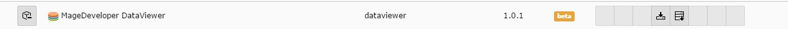
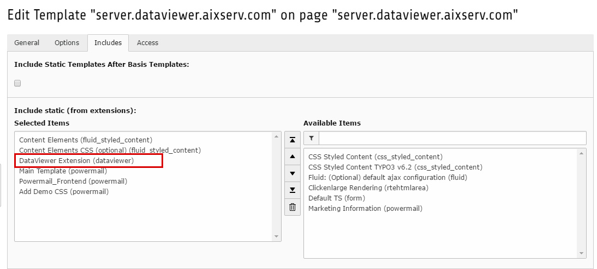
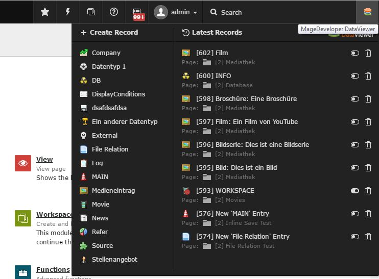

.. include:: ../Includes.txt

.. _installation:

.. image:: ../Images/logo_dataviewer.png

Installation & Configuration
----------------------------

Step 1 - Installing the Extension to your TYPO3 instance
========================================================

Please install the extension in your TYPO3 instance.
Once it is correctly installed and fits the version dependency,
it should appear in your extension list as seen in the following screenshot.

Step 2 - Include Static Template to your Site Template
======================================================

In order to add all fieldtypes and validators, it is necessary to include
the static template ``DataViewer Extension (dataviewer)`` to your Site Template.
Please refer to the following screenshot for more information.

Step 3 - Clear all caches
=========================

It is important to clear all the caches.

Additional Configuration
========================

Pre-Defining Templates for the Template Selector
~~~~~~~~~~~~~~~~~~~~~~~~~~~~~~~~~~~~~~~~

You manually can add predefined templates to the template selector for easy usage.
You have to edit the TypoScript of your Page-Template and add the following information. (example)

.. code-block:: html

     plugin.tx_dataviewer.templates {
         MOVIE = --div--
         movieList = fileadmin/templates/dataviewer/movies/List.html
         movieDetail = fileadmin/templates/dataviewer/movies/Detail.html
         DATA = --div--
         main = fileadmin/templates/dataviewer/data/main.html
         record = fileadmin/templates/dataviewer/data/record.html
         EXTENSION = --div--
         external = EXT:ext/Resources/Private/Templates/DataViewer/External.html
     }

Toolbar Item
~~~~~~~~~~~~

DataViewer adds an icon to the toolbar in the backend. With this
toolbar item, you can easy manage or create records of existing datatypes.

To deactivate the toolbar, you need to disable it in the User TSconfig with
the following code

.. code-block:: html

    options {
        dataviewer {
           disableDataViewerToolbarItem = 1
        }
    }
