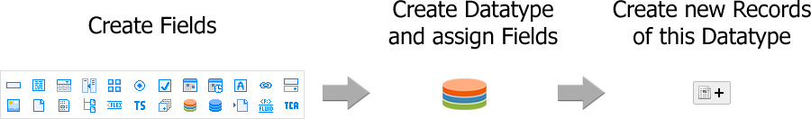

.. ==================================================
.. FOR YOUR INFORMATION
.. --------------------------------------------------
.. -*- coding: utf-8 -*- with BOM.

.. include:: ../Includes.txt

.. _introduction:

.. image:: ../Images/logo_dataviewer.png

Introduction
------------

This extension can render records by TCA-based configuration without the need of creating a new
extension for every record-type you need. You can create new record-types on the fly with every
advantage of TCA.

These records are accessible and rendered in fluid-templates.

Fields in this extension are rendered in mostly the same way as the normal TCA rendering happens, but there
is no need for creating an extra extension for every record-type. 

Here are some examples for records:

- News Records (like tt_news)
- Job Records (like dmmjobcontrol)
- Address Records (like tt_address)
- Event Records (like cal)
- Media Records for building a Media-Library
- Product Records 
- Award Records
- Company Records
- Form Answer Records for creating Frontend Forms and saving the results as a form answer record
- and a lot more!

The estimated time for creating all these things are far better than creating a new extension for these.

The extension contains various Frontend-Plugins to help and support you with displaying records as of your needs.
It is dynamically in every way, even to include records to another extension is possible!

Highlights
==========
- Create customized records on the fly
- Plugins for List, Detail, Sort, Filter, Selection and Search
- Dynamic Configuration of the Plugins to get nearly every solution
- Inject records to other extensions with a InjectViewHelper
- Inject dynamic variables of different types to the fluid templates
- Easy fluid templating with intuitive variable naming
- Import CSV Files as Records

Please see the Screenshots-Section for more information about the possibilities.
 
Workflow
========

+-----+-------------------------------------------------------------+
| 1.  | Create Fields for your Datatypes                            |
+-----+-------------------------------------------------------------+
| 2.  | Create a Datatype and assign the Fields created in '1.'     |
+-----+-------------------------------------------------------------+
| 3.  | Create Records of a Datatype                                |
|     +-------------------------------------------------------------+
|     | *This step is also relevant for your editors and            |
|     | could also take place after you've done the                 |
|     | templating.*                                                |
+-----+-------------------------------------------------------------+
| 4.  | Create Fluid Templates for the records (e.g. List, Detail)  |
+-----+-------------------------------------------------------------+
| 5.  | Insert Record-Plugin to your site to display record(s)      |
+-----+-------------------------------------------------------------+
| 6.  | Add the other plugins like Filter or Search to your site    |
|     | And target them to the Record-Plugin added in '5.'          |
+-----+-------------------------------------------------------------+
