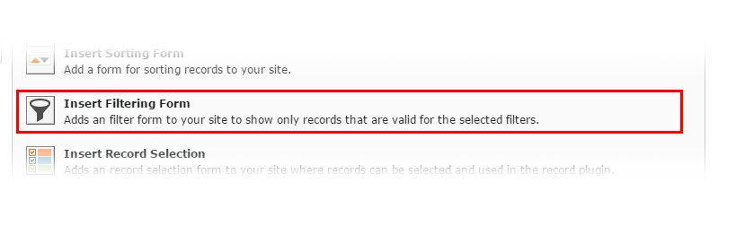

.. include:: ../../Includes.txt

.. _filter:

.. image:: ../../Images/logo_dataviewer.png

Filter Plugin
-------------

This plugin is made for filtering over the records plugin. The filters are configurable and the options can be added directly the
plugin.

Configuration
~~~~~~~~~~~~~

Target record display plugin, which will follow this plugin
   Please select the target record plugin. The plugin will then follow this plugin.

Fields for filtering
   This sets up all fields that will be taken into the filter navigation. You need to
   select a field that will be used for a filter and also the frontend type that determines
   how a filter will be displayed in the frontend.

Options for filters
   This setting adds the options or values to the filters, that are configured above.
   Each Option needs a Name, a condition for the SQL Query and the requested value.
   These options are converted to a SQL Query which can be showed up in the Debug Mode in
   the record plugin.

*Each option needs to be assigned to a field that is used for the filtering above.*
