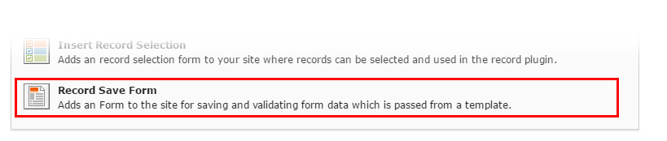

.. include:: ../../Includes.txt

.. _form:

.. image:: ../../Images/logo_dataviewer.png

Form Plugin
-----------

With this plugin you can create new records or edit existing records by creating a fluid templates with fields, that
are equal to the records fields. The record will be automatically validated during form post.

Configuration
~~~~~~~~~~~~~

DataViewer Settings
###################
* **Record-Datatype for the Storage**
Please select the record type which will be stored when the form is posted.

* **Record Storage Page**
Please select the record storage page.

Template Settings
#################
* **Fluid-Template**
The template that displays the form.

* **Variable Injection**
Select the variables, that will be injected into the fluid template.

Developer Settings
##################
* **Debug**
Enable this setting to get an debug output when the form is posted.
This setting can help a developer to check for possible errors and to validate
the form.
