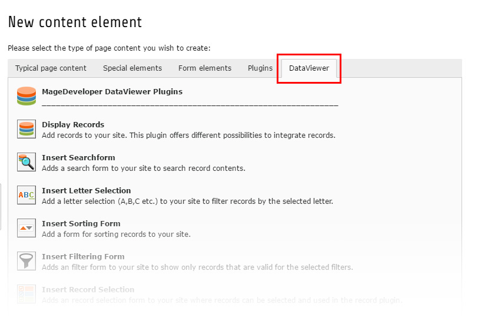

.. include:: ../Includes.txt

.. _plugins:

.. image:: ../Images/logo_dataviewer.png

Frontend Plugins
----------------

This extension delivers out-of-the-box a various amount of Frontend-Plugins for displaying and handling the records.

* Main Plugin to display records or a record-part
* Search Plugin that filters the records for the entered search-term
* Letter Selection Plugin for selecting a letter as first char
* Sort Plugin to sort the list of records
* Filter Plugin to filter in the list of records
* Select Plugin to select records from a list and to compute the selection
* Form Plugin to generate frontend forms for editing or creating new records

*You can choose the plugins in the New content element-Wizard:*

.. note:: **In order to fill the fields in the plugins, it is necessary that you select a Record-Storage Page and
          then press the Save-Button to refresh the form with the new storage pages!**

Detailed Information about the plugins:

.. toctree::
   :maxdepth: 1
   :titlesonly:
   :glob:

   Record/Index
   Search/Index
   Letter/Index
   Sort/Index
   Filter/Index
   Select/Index
   Form/Index
   Pager/Index
