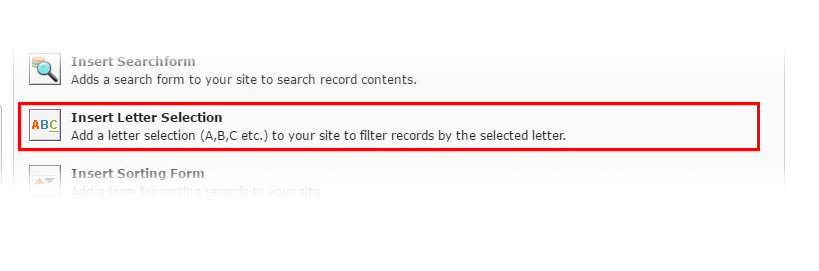

.. ==================================================
.. FOR YOUR INFORMATION
.. --------------------------------------------------
.. -*- coding: utf-8 -*- with BOM.

.. include:: ../Includes.txt

.. _letter:

.. image:: ../../Images/logo_dataviewer.png

Letter Selection Plugin
-----------------------

This plugin generates a list with all letters. If a letter is clicked, it adds an filter to select only records
that are valid for the beginning letter, that was selected.

Configuration
~~~~~~~~~~~~~   

* **Target record display plugin, which will follow this plugin**
Please select the target record plugin. The plugin will then follow this plugin.

* **Field**
The according field for the letter selection. You can either select a field or leave the setting on the record title.

* **Preselected letter**
This setting can pre-select a letter. This letter is used when the page loads.
