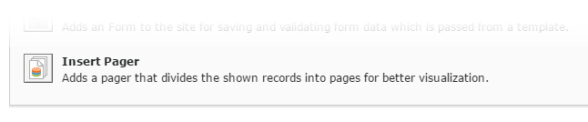

.. include:: ../../Includes.txt

.. _letterplugin:

.. image:: ../../Images/logo_dataviewer.png

Pager Plugin
-----------------------

The pager plugin inserts a pagination control to the page for paging records and selecting the
record count that is displayed.

Configuration
~~~~~~~~~~~~~

Target record display plugin, which will follow this plugin
   Please select the target record plugin. The plugin will then follow this plugin.

List of entries for 'Per Page'-Field (Comma separated)
   Please enter a comma separated list of values for the 'Per Page'-Field.

Show 'View All' selection
   This adds a selection for viewing all records to the 'Per Page'-Field.
