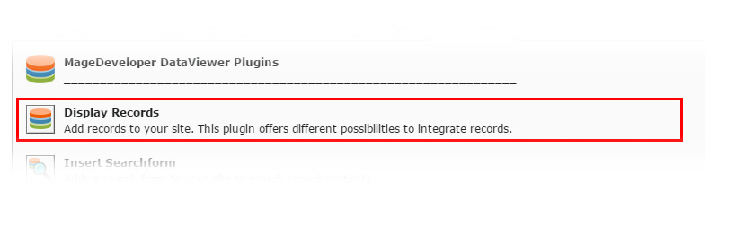

.. include:: ../../Includes.txt

.. _recordplugin:

.. image:: ../../Images/logo_dataviewer.png

Record Plugin
-------------

This is the main plugin. It is necessary to display records, a single record or a part of a record.
The records are filtered through all plugin filters, Field/Value Filters and sortings first and
will then be injected to the template.

Configuration
~~~~~~~~~~~~~

DataViewer Settings
###################

Plugin Type
   This selects the type of which data is injected to the fluid template.
   It can be one of the following:

   +-------------------------+--------------------------------------------------------------+
   | **List**                | Multiple Records injected to ``{records}``                   |
   +-------------------------+--------------------------------------------------------------+
   | **Detail**              | Fixed Record from selection is injected to ``{record}``      |
   +-------------------------+--------------------------------------------------------------+
   | **Part of a record**    | A part from a record is injected to ``{part}``               |
   +-------------------------+--------------------------------------------------------------+
   | **Dynamic Detail**      | Dynamic injected record from Url Parameter to ``{record}``   |
   +-------------------------+--------------------------------------------------------------+

Record Selection Type / Allow or Show records by selection type
   The records that are selected in this option will be used for getting available records.

Page for Detail View
   Records can be linked to a detail page which has a  "Dynamic Detail" Plugin.
   To link a record, you can use a ViewHelper:

   ::

	   {namespace dv = MageDeveloper\Dataviewer\ViewHelpers}
	   <dv:record.link record="{record}" pid="{settings.detail_page_id}" additionalParams="{backPageId:'32'}">{record.title}</dv:record.link>

Record Storage Page
   Please select the record storage page where the records are stored.

Field/Value Filter Settings
###########################

Available Markers
   If you created Template Variables on the storage pages, these will be available as markers in the Filter-Field Value Input Field.
   This gives you the possibility to create dynamic filters for getting your record(s) injected to the template.

Records by field/value filter
   You can add filters to get only records injected to the template that will fit the filters.
   Each filter is converted to a SQL WHERE which can be showed up in the Debug Mode.

Display Settings
################

Number of records
   This sets the number of records that will be injected to the template. If you leave this setting to ``0``, all
   found records will be available.

Default-Selected 'Items per Page'-Value
   If there is a Sort-Plugin on the same page, the Default Selected Value will contain this setting.

Default Sort Field
   The default sort field, when the page loads.

Default Sort Order
   The default sort order, when the page loads.

Force these sorting settings
   Forces the configured sorting settings. This can also be used to clear the sorting parameters from the user session.

Template Settings
#################

Template Selection
   The template where the record(s) are injected. You can either manually select a template or predefine templates.

Variable Injection
   Select the variables, that will be injected into the fluid template.

Developer Settings
##################

Debug
   Enable this setting to get an debug output when the form is posted.
   This setting can help a developer to check for possible errors and to validate
   the form.

