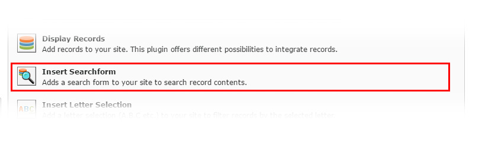

.. include:: ../../Includes.txt

.. _searchplugin:

.. image:: ../../Images/logo_dataviewer.png

Search Plugin
-------------

This plugin is used to insert a searchform to your page for searching through a record list.

Configuration
~~~~~~~~~~~~~

DataViewer Settings
###################

Target record display plugin, which will follow this plugin
   Please select the target record plugin. The plugin will then follow this plugin.

Search type configuration
   The type of the search for selecting what values are valid for the entered search-term.

   +------------------------------------------------+--------------------------------------------------------------+
   | **Search through record title**                | Searches only through each record title for matching results |
   +------------------------------------------------+--------------------------------------------------------------+
   | **Search through fields**                      | Searches through selected fields for matching results        |
   +------------------------------------------------+--------------------------------------------------------------+
   | **Search through record title and fields**     | Searches through both record title and selected fields       |
   +------------------------------------------------+--------------------------------------------------------------+

Minimum chars for search
   The minimum amount of chars that is needed to run the search

Clear on Page Load
   If this checkbox is enabled, the search-term is cleared on a new page load. This resets the search.

Field Search Settings
#####################

.. note:: This tab is only available if you set the search type to ``Search through fields`` or ``Search through record title and fields``.

Fields for search
   These fields are used for searching through all records to find the matching results.
   Each filter is converted to a SQL WHERE which can be showed up in the Debug Mode of the records plugin.
