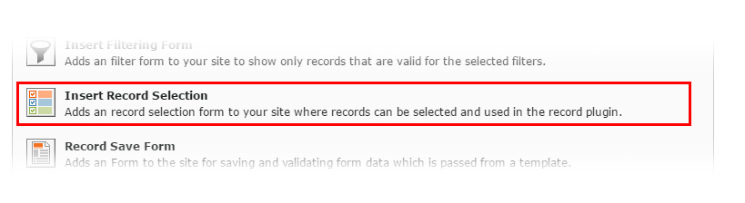

.. include:: ../../Includes.txt

.. _select:

.. image:: ../../Images/logo_dataviewer.png

Selection Plugin
----------------

This plugin is for selecting records.The selection is passed over to the Records-Plugin.
This can be used for example for record comparison or quick detail view of the selection.

DataViewer Settings
###################

* **Target record display plugin, which will follow this plugin**
Please select the target record plugin. The plugin will then follow this plugin.

* **Record Selection Type / Allow or Show records by selection type**
The records that are selected in this option will be used for getting available records.

* **Record Storage Page**
Please select the record storage page where the records are stored.

Field/Value Filter Settings
###########################

* **Available Markers**
If you created Template Variables on the storage pages, these will be available as markers in the Filter-Field Value Input Field.
This gives you the possibility to create dynamic filters for getting your record(s) injected to the template.

* **Records by field/value filter**
You can add filters to get only records injected to the template that will fit the filters.
Each filter is converted to a SQL WHERE which can be showed up in the Debug Mode.

Display Settings
################

* **Selection Limit**
The amount of records that can be selected.

* **Available Markers**
The records that will be pre-selected when the page loads.

* **Auto-Submit**
Automatically submits the form when a checkbox is clicked.
